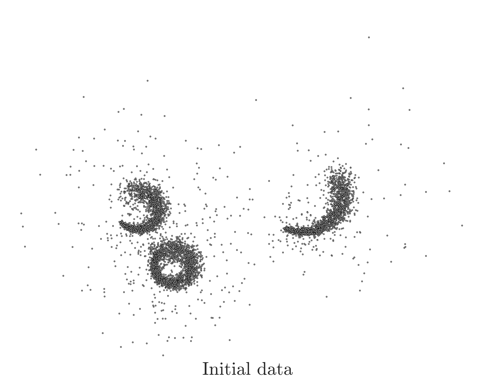
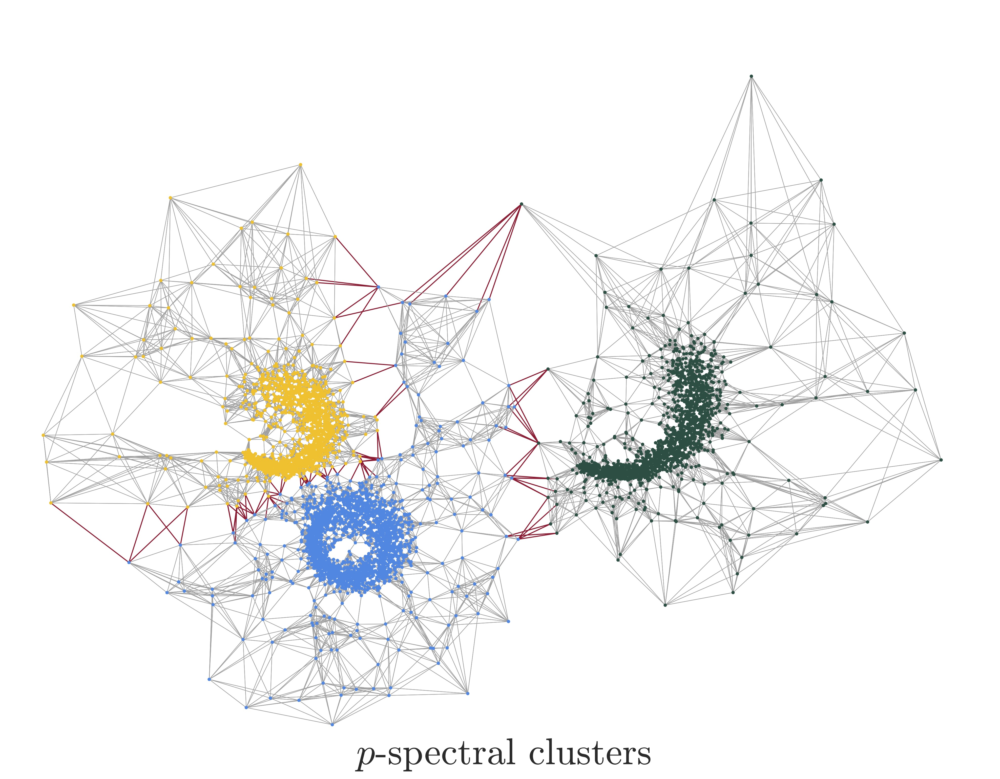

# Multiway p-spectral graph cuts on Grassmann manifolds

This repository contains the official code for the paper "*Multiway p-spectral graph cuts on Grassmann manifolds.*" published at [Machine Learning, 2022](https://link.springer.com/article/10.1007/s10994-021-06108-1).

<p align="center">
  
  
</p>
<center>
In this work, we developed a new method for multiway p-spectral clustering that leverages recent advancements in Riemannian optimization. This was achieved by reformulating the problem of obtaining multiple eigenvectors of the graph p-Laplacian as an unconstrained minimization problem on a Grassmann manifold.
</center>

[](https://zenodo.org/badge/latestdoi/541179044)


### Motivation

Reformulating the spectral method from the traditional 2-norm to the p-norm has proven to lead to a **sharp approximation of balanced cut metrics** and **improved clustering assignments**. Such re-formulations result in a tight relaxation of the spectral clustering problem, with the resulting solutions **approximating closely the solution of the original discrete problem**.


### A Grassmannian optimization approach to p-spectral clustering

We propose a new multiway p-spectral clustering method, and recast the problem of finding multiple eigenpairs of the graph p-Laplacian as a Riemannian optimization problem on a Grassmann manifold. Our code builds on top of the recursive p-spectral bipartitioning code by [Bühler and Hein](https://www.ml.uni-saarland.de/code/pSpectralClustering/pSpectralClustering.htm), and utilizes the [ROPTLIB](https://www.math.fsu.edu/~whuang2/Indices/index_ROPTLIB.html) Riemannian manifold optimization library (See acknoledgements for citations). 
  
### Requirements
All the algorithms are implemented in MATLAB R2021b. The necessary paths are included in the script [addpaths_pGrass.m](src/addpath_pGrass.m). The code has been tested in Mac and Ubuntu distributions.

### Usage

The main script [`Benchmark_pGrassmann.m`](src/Benchmark_pGrassmann.m) runs the experiments on the input data, located at the [`Input/Graphs`](Input/Graphs) folder in .mat format.

**Input data**: The [LFR data](https://arxiv.org/abs/0805.4770) were used in Section 4.3.1 ***Reducing the value of p***, the synthetic Gaussian graphs in Section 4.3.2 ***Increasing the number of clusters (k)***, and the [Omniglot](https://github.com/brendenlake/omniglot) graphs in Section 4.4.2 ***Classification of Handwritten Characters***


**Run**: To perform clustering on the available input data include the desired dataset in ``cases{}`` (Line 62), and type in the matlab command line
```
>> cd src/
>> Benchmark_pGrassmann
```

The following parameters (Lines 98 - 102) control important features of the algorithm:
```
p_final      = 1.100; % final value of p
factor       = .9;    % factor of p-reduction (only if use_p_contin == 0)
normalized   = 1;     % 1/0 normalized/unnormalized p-clustering
use_p_contin = 1;     % 1/0 use pseudo-continuation for the reduction of p
```
**Output**: The output is printed in the command window for each case under question, or saved to a file if ``write_output_to_file = true`` (Line 36). It includes the value of p at which the best partitioning was found (pBest), the values of ratio and normalized cut (RCut/NCut), the values of ratio and normalized Cheeger cut (RCCut/NCCut) and the modularity of the clusters (Modul). The accuracy of the clustering assignment is measured in terms of unsupervised clustering accuracy (ACC), variaton of information (VI), clustering error (CE) and normalized mutual information (NMI). Last, the time-to-solution for each graph is diplayed.

#### Code Structure

The structure of the files in this repository is as follows:
```

├── Figures                     # some graphical results
├── Input                       # input graphs in .mat format
├── pSpectralClustering         # the recursive bipartitioning approach as per Bühler and Hein, 2009
├── ROPTLIB                     # the roptlib manifold optimization library
├── src                         # source code of the paper
├── src/Auxilliary              # auxilliary functions
├── src/Metrics                 # evaluation of the clustering results
├── src/Optimization            # objective, gradient and hessian computations
```

Further details are documented within the code.


### Maintainers
- [Dimosthenis Pasadakis](https://dmspas.github.io/) ([dimosthenis.pasadakis@usi.ch](mailto:dimosthenis.pasadakis@usi.ch))
- [Christie Alappat](https://www.rrze.fau.de/1/christie-alappat/) ([christie.alappat@fau.de](mailto:christie.alappat@fau.de))

### Acknowledgements
Our approach is using elements from the following publications:
1. Bühler T, Hein M (2009) Spectral clustering based on the graph p-Laplacian. In: Proceedings of the 26th Annual International Conference on Machine Learning, ACM, New York, NY, USA, ICML '09.
2. Huang W, Absil PA, Gallivan KA, Hand P (2018) Roptlib: An object-oriented c++ library for optimization on riemannian manifolds. ACM Trans Math Softw 44(4).


### Citation

```
@article{PaAlScWe2022,
author={Pasadakis, D. and Alappat, C. L. and Schenk, O. and Wellein, G.},
title={Multiway p-spectral graph cuts on {G}rassmann manifolds},
journal={Machine Learning},
year={2022},
month={Feb},
day={01},
volume={111},
publisher = {Springer Science and Business Media {LLC}},
number={2},
pages={791-829},
issn={1573-0565},
doi={10.1007/s10994-021-06108-1}
}
```
